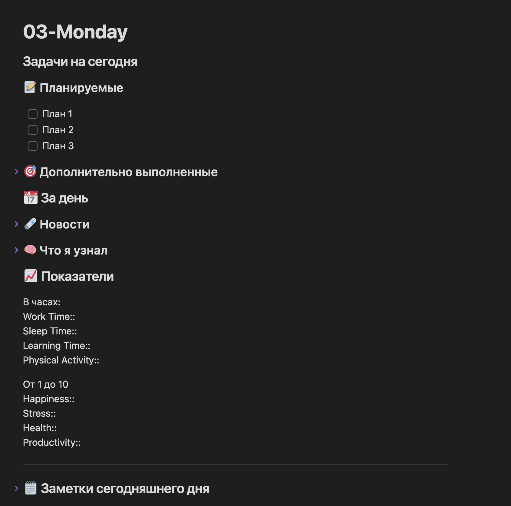
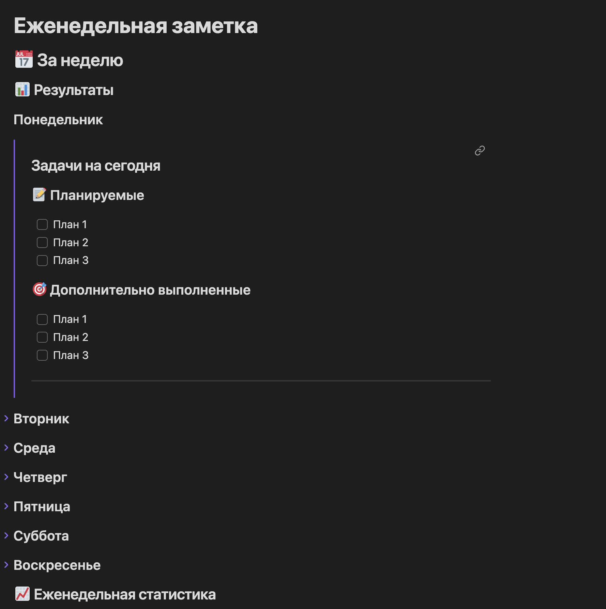
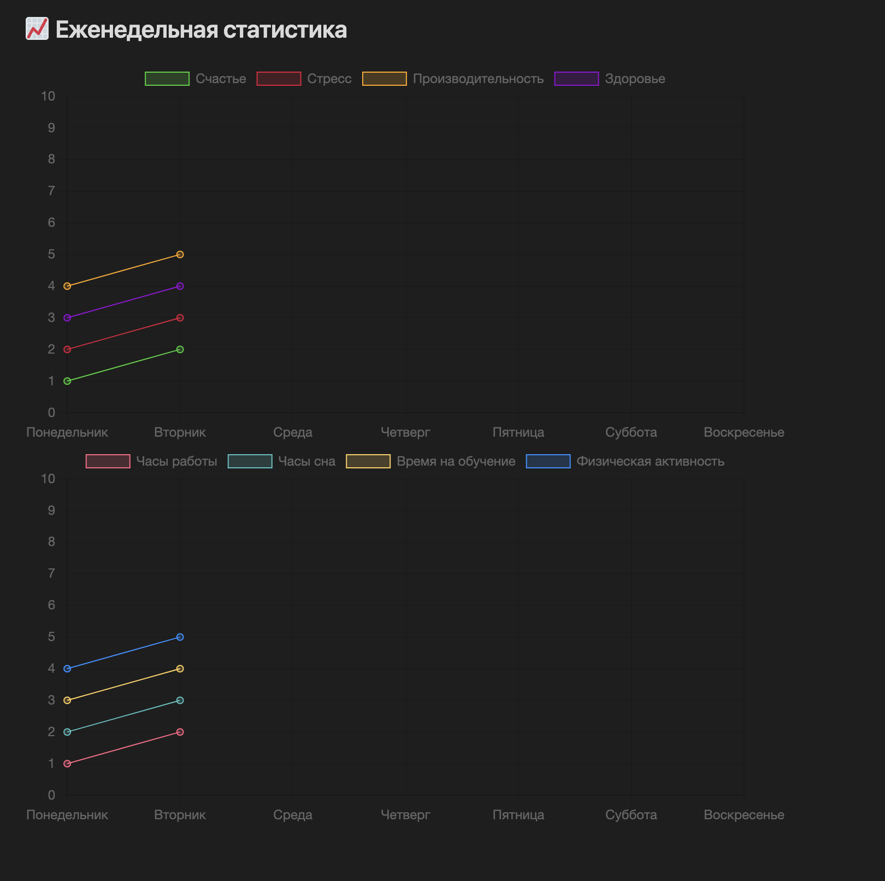

# Obsidian-NoteTemplates

Obsidian-NoteTemplates - это коллекция шаблонов для заметок в Obsidian. Данные шаблоны помогут улучшить организацию и эффективность вашей работы. Они также содержат подробные инструкции по их применению.

## Предварительные условия

Перед началом убедитесь, что у вас установлены следующие расширения. Без них данная конфигурация скорее всего не будет работать:

- **Templater**: Используется для динамического изменения некоторых текстовых элементов в файлах во время генерации. Вам нужно будет включить опцию "Запуск Templater при создании нового файла" в настройках.

- **Obsidian Calendar**: Используется для создания ежедневных и еженедельных заметок. По желанию можно использовать Periodic Notes, которые являются более настраиваемыми и мощными, но для данной конфигурации это излишне.

- **Obsidian Charts** & **Obsidian Dataview**: Используются для визуализации и обработки ваших еженедельных данных.

## Форматирование заметок

Ваша структура заметок по умолчанию будет следующей:

- Заметки
    - YYYY
        - Неделя W
            - DD-dddd

Если вы хотите изменить эту структуру, вам, возможно, придется модифицировать код Templater.

## Настройка

### Ежедневные заметки

- Установите новое расположение файла как Заметки/.
- Добавьте YYYY/[Week] w/DD-dddd в формат даты.

### Календарь

- Включите номера недели.
- Добавьте YYYY/[Week] w/[Weekly Notes] в формат еженедельной заметки.

## Установка шаблонов

Скопируйте файлы шаблонов в свое хранилище. Это можно сделать, скопировав, скачав или клонировав файлы шаблонов в каталог Заметки/. Затем установите соответствующие файлы как шаблоны в настройках.

## Примеры

### Шаблон ежедневной заметки

### Шаблон еженедельной заметки

### Визуализация статистики
